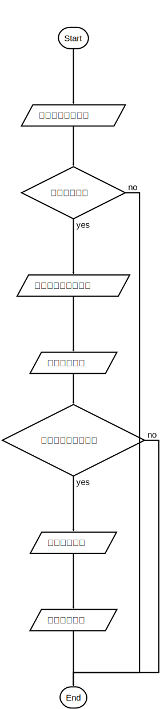

# ThuVisionFaceSDK Windows edition, **visual studio 2015**, 推荐使用[马克飞象](https://maxiang.io/)在线查看
----
## 人脸识别相关接口定义 V1.2

----
## 调用流程


其中**人脸质量判断**步骤不是必须。
```flow
st=>start: Start
i1=>inputoutput: 输入一张人脸图像
i2=>inputoutput: 获取归一化人脸图像
i3=>inputoutput: 获取人脸质量
i4=>inputoutput: 获取人脸特征
i5=>inputoutput: 人脸特征比对
cond1=>condition: 检测到人脸？
cond2=>condition: 人脸质量大于阈值？
o1=>inputoutput: 人脸框
e=>end
st->i1->cond1
cond1(yes)->i2
i2->i3->cond2
i4->i5
cond1(no)->e
i5->e
cond2(no)->e
cond2(yes)->i4
```

----
### 1.&nbsp;&nbsp;人脸检测
```c++
namespace vision {
	class VISION_API VisionFaceDetect
	{
	public:
		/* 默认析构函数 */
		virtual ~VisionFaceDetect() {}

		/* 初始化，输入参数文件param_path和所要使用的GPU编号device_id */
		virtual bool Init(std::string param_path = "models_v2/face_detect_cascade.json", int device_id = 0) = 0;

		/* 输入一张图像img，获取人脸信息（包括人脸框和关键点）；在输入视频的情况下，将is_video_stream设置为true，能够极大提升检测速度 */
		virtual std::vector<VisionFace> GetFaces(const cv::Mat& img, bool is_video_stream = false) = 0;

		/* 输入一张图像img，返回所有的人脸框以及对应的人脸关键点（引用形式返回） */
		virtual std::vector<cv::Rect> GetFaces(const cv::Mat& img, std::vector<std::vector<cv::Point2f>>& key_pts, bool is_video_stream = false) = 0;

		/* 获取图像img中最大人脸的人脸框 */
		virtual std::vector<VisionFace> GetMaximumFace(const cv::Mat& img, bool is_video_stream = false) = 0;

		/* 将人脸框face_rect绘制在图像img上 */
		virtual void DrawFaceRect(cv::Mat& img, cv::Rect face_rect) = 0;

		/* 以下接口为高级接口，一般情况下不需要使用 */
		virtual void SetRedetectInterval(int interval = 8) = 0;
		virtual void SetMinFaceSize(int size = 35) = 0;
		virtual void SetScaleFactor(float factor = 0.71f) = 0;
		virtual void SetMaxWidthGlobal(int size = 640) = 0;
		virtual void SetDetectThd(float thd1 = 0.75f, float thd2 = 0.85f, float thd3 = 0.90f) = 0;
		virtual void SetStepSize(int size = 4) = 0;
	};

	/* 构造对象，默认使用GPU 0 */
	VISION_API VisionFaceDetect* instantiateVisionFaceDetect(int device_id = 0);

	/* 销毁对象 */
	VISION_API void destroyVisionFaceDetect(VisionFaceDetect* ptr);
}
```
示例代码
```c++
// 摄像头测试
void CameraTest()
{
	VisionFaceDetect *face_detect = instantiateVisionFaceDetect();
	cv::VideoCapture capture(0);
	Mat img;

	while (true)
	{
		capture >> img;

		if (!img.empty()) {
			Mat img_show = img.clone();
			double start = cv::getTickCount();
			std::vector<cv::Rect> face_rects;

			std::vector<std::vector<cv::Point2f>> key_pts;
			face_rects = face_detect->GetFaces(img, key_pts); // 获取人脸框位置同时获取每张脸的5个关键点

			for (int i = 0; i < face_rects.size(); i++)
			{
				face_detect->DrawFaceRect(img_show, face_rects.at(i));
			}
			cv::imshow("img_show", img_show);
			if (cv::waitKey(5) == 27)
			{
				break;
			}
		}
	}
	vision::destroyVisionFaceDetect(face_detect);
}
```

----
### 2.&nbsp;&nbsp;关键点定位和归一化
```c++
namespace vision {
	class VISION_API VisionFaceAlignment
	{
	public:
		/* 默认析构函数 */
		virtual ~VisionFaceAlignment() {}

		/* 初始化，输入参数文件param_path和所要使用的GPU编号device_id */
		virtual bool Init(std::string param_path = "models_v2/face_align.json", int device_id = 0) = 0;

		/* 输入一张图像img和人脸框face_rect，输出人脸的关键点位置 */
		virtual std::vector<cv::Point2f> GetKeyPoints(const cv::Mat& img, const cv::Rect& face_rect) = 0;

		/* 批量获取人脸的关键点位置 */
		virtual std::vector<std::vector<cv::Point2f>> GetKeyPoints(const cv::Mat& img, const std::vector<cv::Rect>& face_rects) = 0;

		/* 输入一张图像img和人脸框face_rect，输出一张归一化人脸（180x220）。若padding是true，则在图像变换的时候采用周边的像素进行补充 */
		virtual cv::Mat GetAlignedFace(const cv::Mat& img, const cv::Rect& face_rect, bool padding = false) = 0;

		/* 批量获取归一化人脸 */
		virtual std::vector<cv::Mat> GetAlignedFace(const cv::Mat& img, const std::vector<cv::Rect>& face_rect, bool padding = false) = 0;

		/* 输入一张图像img和人脸关键点key_pts，输出一张归一化人脸 */
		virtual cv::Mat GetAlignedFace(const cv::Mat& img, const std::vector<cv::Point2f>& key_pts, bool padding = false) = 0;

		/* 批量获取归一化人脸 */
		virtual std::vector<cv::Mat> GetAlignedFace(const cv::Mat& img, const std::vector<std::vector<cv::Point2f>>& key_pts, bool padding = false) = 0;

		/* 根据人脸关键点，获取人脸姿态，pitch、yaw、roll */
		virtual std::vector<float> GetHeadPose(const std::vector<cv::Point2f>& key_pts) = 0;

		/* 批量获取人脸姿态 */
		virtual std::vector<std::vector<float>> GetHeadPose(const std::vector<std::vector<cv::Point2f>>& key_pts) = 0;
	};

	/* 构造对象，新增变量device_id，默认使用GPU 0 */
	VISION_API VisionFaceAlignment* instantiateVisionFaceAlignment(int device_id = 0);

	/* 销毁对象 */
	VISION_API void destroyVisionFaceAlignment(VisionFaceAlignment* ptr);
}
```
示例代码
```c++
void CameraTest()
{
	VisionFaceDetect* face_detect = instantiateVisionFaceDetect();
	VisionFaceAlignment* face_align = instantiateVisionFaceAlignment();

	cv::VideoCapture capture(0);
	Mat img;

	while (true)
	{
		capture >> img;
		std::vector<std::vector<cv::Point2f>> key_pts;
		std::vector<cv::Rect> face_rects = face_detect->GetFaces(img, key_pts);
		// warning: CPU模式下，人脸检测不会返回关键点，需要通过VisionFaceAlignment获取关键点
		if (key_pts.size() == 0)
		{
			key_pts = face_align->GetKeyPoints(img, face_rects);
		}

		for (int i = 0; i < key_pts.size(); i++)
		{
			for (int j = 0; j < key_pts.at(i).size(); j++)
			{
				cv::circle(img, key_pts.at(i).at(j), 2, cv::Scalar(255, 0, 0), 2);
			}
		}

		std::vector<cv::Mat> norm_faces = face_align->GetAlignedFace(img, key_pts);
		if (norm_faces.size() > 0)
		{
			cv::imshow("norm_face", norm_faces[0]);
		}

		cv::imshow("alignment result", img);

		if (cv::waitKey(5) == 27)
		{
			break;
		}
	}

	vision::destroyVisionFaceDetect(face_detect);
	vision::destroyVisionFaceAlignment(face_align);
}
```

----
### 3.&nbsp;&nbsp;人脸特征提取
```c++
namespace vision {
	class VISION_API VisionFaceFeature
	{
	public:
		/* 默认析构函数 */
		virtual ~VisionFaceFeature() {}

		/* 初始化，输入参数文件param_path和所要使用的GPU编号device_id */
		virtual bool Init(std::string param_path = "models_v2/face_feature.json", int device_id = 0) = 0;

		/* 获取输入归一化人脸图像img的特征 */
		virtual std::vector<float> GetFeature(const cv::Mat& img) = 0;

		/* 批量获取归一化人脸图像特征 */
		virtual std::vector<std::vector<float>> GetFeature(const std::vector<cv::Mat>& imgs) = 0;

		/* 获取两张人脸特征的相似度 */
		virtual float GetScore(const std::vector<float>& fea1, const std::vector<float>& fea2) = 0;
	};

	/* 构造对象， 默认使用GPU 0 */
	VISION_API VisionFaceFeature* instantiateVisionFaceFeature(int device_id = 0);

	/* 销毁对象 */
	VISION_API void destroyVisionFaceFeature(VisionFaceFeature* ptr);
}
```
示例代码
```c++
void CameraTest()
{
	VisionFaceDetect* face_detect = instantiateVisionFaceDetect();
	VisionFaceAlignment* face_align = instantiateVisionFaceAlignment();
	VisionFaceFeature* face_feature = instantiateVisionFaceFeature();
	// warning, VisionFaceFeature必须进行初始化。默认的模型无法满足需求
	if (!face_feature->Init("models/ResNet224_1202_iter_260000.json", 1))
	{
		return;
	}

	cv::VideoCapture capture(0);
	Mat img;

	while (true)
	{
		capture >> img;
		std::vector<std::vector<cv::Point2f>> key_pts;
		std::vector<cv::Rect> face_rects = face_detect->GetFaces(img, key_pts);
		// warning: CPU模式下，人脸检测不会返回关键点，需要通过VisionFaceAlignment获取关键点
		if (key_pts.size() == 0)
		{
			key_pts = face_align->GetKeyPoints(img, face_rects);
		}

		for (int i = 0; i < key_pts.size(); i++)
		{
			for (int j = 0; j < key_pts.at(i).size(); j++)
			{
				cv::circle(img, key_pts.at(i).at(j), 2, cv::Scalar(255, 0, 0), 2);
			}
		}

		std::vector<cv::Mat> norm_faces = face_align->GetAlignedFace(img, key_pts);
		if (norm_faces.size() > 0)
		{
			cv::imshow("norm_face", norm_faces[0]);
			// warning， 人脸特征提取的输入必须是归一化人脸图像
			std::vector<float> feature = face_feature->GetFeature(norm_faces[0]);
			for (int i = 0; i < feature.size(); i++)
			{
				std::cout << feature.at(i) << std::endl;
			}
		}

		cv::imshow("alignment result", img);

		if (cv::waitKey(5) == 27)
		{
			break;
		}
	}

	vision::destroyVisionFaceDetect(face_detect);
	vision::destroyVisionFaceAlignment(face_align);
	vision::destroyVisionFaceFeature(face_feature);
}
```

---
### 4.&nbsp;&nbsp;人脸比对
```c++
namespace vision {

	struct VisionFaceCompareResult
	{
		int idx;
		float score;
	};

	class VISION_API VisionFaceCompare
	{
	public:
		/* 默认构造函数 */
		virtual ~VisionFaceCompare() {}

		/* 初始化模块，构建Database，输入特征维数feature_dim和特征的个数number（可以更改） */
		virtual bool Init(int feature_dim, int number) = 0;

		/* 重新调整需要存储的特征的个数，并且选择是否保留已有的数据 */
		virtual void ReSize(int number, bool reserve_data = true) = 0;

		/* 清除Database中的数据 */
		virtual void Clear() = 0;

		/* 将特征添加到Database */
		virtual bool Add(const std::vector<float>& feature) = 0;

		/* 获取比对相似度Top N的比对结果 */
		virtual std::vector<VisionFaceCompareResult> GetResult(const std::vector<float>& feature, int top_k = 10) = 0;

		/* 获取两张图片之间的相似度 */
		virtual float GetScore(const std::vector<float>& fea1, const std::vector<float>& fea2) = 0;
	};

	/* 构造对象 */
	VISION_API VisionFaceCompare* instantiateVisionFaceCompare();

	/* 销毁对象 */
	VISION_API void destroyVisionFaceCompare(VisionFaceCompare* _ptr);
}
```
示例代码
```c++
int main()
{
	vision::VisionFaceCompare* face_compare = vision::instantiateVisionFaceCompare();

	int NUMBER = 1000000;
	int FEATURE_DIM = 256;
	// 为Database分配空间
	face_compare->Init(FEATURE_DIM, NUMBER);

	for (int i = 0; i < NUMBER; i++)
	{
		std::vector<float> tmp;
		for (int j = 0; j < FEATURE_DIM; j++)
		{
			tmp.push_back(Rand());
		}
		// 将人脸特征写入Database
		face_compare->Add(tmp);
	}

	// 构建用于查询的feature
	std::vector<float> tmp;
	for (int i = 0; i < FEATURE_DIM; i++)
	{
		tmp.push_back(Rand());
	}

	std::vector<vision::VisionFaceCompareResult> result;

	for (int i = 0; i < 10; i++)
	{
		double start_time = clock();
		// 获取相似度最高的10个结果
		result = face_compare->GetResult(tmp, 10);

		// Sleep(1000);
		double end_time = clock();
		std::cout << "The run time is:" << (end_time - start_time) / CLOCKS_PER_SEC * 1000 << "ms!" << std::endl;
	}

	for (int i = 0; i < result.size(); i++)
	{
		std::cout << result.at(i).idx << " - " << result.at(i).score << std::endl;
	}

	return 0;
}
```

---
### 5.&nbsp;&nbsp;人脸质量判断
```c++
namespace vision {
	class VISION_API VisionFaceQuality
	{
	public:
		/* 默认析构函数 */
		virtual ~VisionFaceQuality() {}

		/* 初始化，输入参数文件param_path和所要使用的GPU编号device_id */
		virtual bool Init(std::string param_path = "models_v2/face_quality.json", int device_id = 0) = 0;

		/* 输入一张归一化人脸图像，输出人脸质量得分[0,1]，分数越高说明质量越好 */
		virtual float GetFaceQuality(const cv::Mat& img) = 0;

		/* 批量获取人脸图像质量 */
		virtual std::vector<float> GetFaceQuality(const std::vector<cv::Mat>& imgs) = 0;
	};

	/* 构造对象，默认使用GPU 0 */
	VISION_API VisionFaceQuality* instantiateVisionFaceQuality(int device_id = 0);

	/* 销毁对象 */
	VISION_API void destroyVisionFaceQuality(VisionFaceQuality* ptr);
}
```
示例代码
```c++
参照VisionFaceFeature，输入必须是归一化图像。输出结果[0,1]，越靠近1说明人脸质量越高；否则越低。
```

---
### 6.&nbsp;&nbsp;人脸属性（测试中）
```c++
namespace vision {
	class VISION_API VisionFaceAttributes
	{
	public:
		/* 默认析构函数 */
		virtual ~VisionFaceAttributes() {}

		/* 初始化，输入参数文件param_path和所要使用的GPU编号device_id */
		virtual bool Init(std::string param_path = "models_v2/face_attributes.json", int device_id = 0) = 0;

		/* 输入一张归一化人脸图像，输出人脸属性 */
		virtual std::vector<int> GetAttribtues(const cv::Mat& img, std::vector<float>& feature = std::vector<float>()) = 0;

		/* 批量获取人脸属性 */
		virtual std::vector<std::vector<int> > GetAttribtues(const std::vector<cv::Mat>& imgs, std::vector<std::vector<float>>& feature = std::vector<std::vector<float>>()) = 0;
	};

	/* 构造此类的一个对象， 默认使用GPU 0 */
	VISION_API VisionFaceAttributes* instantiateVisionFaceAttributes(int device_id = 0);

	/* 销毁此类的一个对象 */
	VISION_API void destroyVisionFaceAttributes(VisionFaceAttributes* ptr);
}
```
示例代码
```c++
开发测试中
```

---
### 7.&nbsp;&nbsp;人脸跟踪（测试中）
```c++
namespace vision {
	class VISION_API VisionFaceTrack
	{
	public:
		/* 默认析构函数 */
		virtual ~VisionFaceTrack() {}

		/* 初始化，输入参数文件param_path和所要使用的GPU编号device_id */
		virtual bool Init(std::string param_path = "models_v2/face_track.json", int device_id = 0) = 0;

		/* 输入视频序列img，返回此时丢失的跟踪对象 */
		virtual std::vector<VisionFace> Track(const cv::Mat& img) = 0;

		/* 获取当前的所有跟踪信息 */
		virtual std::vector<VisionFace> GetTrackInfo() = 0;

		/* 高级接口 */
		virtual void SetRedetectInterval(int interval = 10) = 0;
		virtual void SetDetectionNonoverlapIou(float iou = 0.5f) = 0;
		virtual void SetFaceVerifyCalScoreThd(float thd = 0.5f) = 0;
		virtual void SetFaceQualityThd(float thd = 0.75f) = 0;
		virtual void SetRefindThd(float thd = 0.55f) = 0;
	};

	/* 构造对象 */
	VISION_API VisionFaceTrack* instantiateVisionFaceTrack(int device_id = 0);

	/* 销毁对象 */
	VISION_API void destroyVisionFaceTrack(VisionFaceTrack* ptr);
}
```
示例代码
```c++
开发测试中
```

----
## General dependencies
#### CPU Edition
- [opencv 3.1.0, vc14](https://pan.baidu.com/s/1dF3yR2D)

#### GPU Edition
- [opencv 3.1.0, vc14](https://pan.baidu.com/s/1dF3yR2D)
- [Cuda 8.0](https://pan.baidu.com/s/1nuI1vy5)
- [Cudnn 5.1](https://pan.baidu.com/s/1nuI1vy5)

----
## Contact
chendd14 <chendd14@163.com>
<div class="footer">
Copyright(c) THU_CV_AI_LAB
</div>
